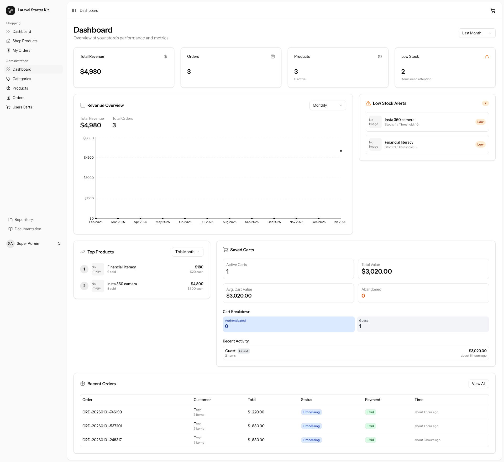

# Laravel eCommerce Platform



A modern, full-stack eCommerce platform built with Laravel 12 and React 19, featuring comprehensive API documentation, type-safe TypeScript SDK, and advanced state management.

## List of features

### Admin Dashboard

- Total Revenue by Week / Month / Year
- Revenue Overview Chart by Day / Week / Month
- Low Stock Alert with Stock and Threshold
- Top Products by Week / Month / Year
- Saved Cart with counts Active, Total Value, Avg. Cart Value, Abandoned, and Guest Carts.
- Recent Orders Status

### Product Management Admin

- Single and variable with attribute.
- Low stock threshold for every product
- Image management and change image order

### Category Management Admin

- Category creation
- Endless child category creation
- Category status management
- Total product count each category has

### Cart Management

- **Admin**
    - Live stock alert on product selling fast
    - Live cart update and alert

- **Guest User**
    - Guest user cart expire in 24 hours.
    - Auto sync guest cart to account on signin during checkout.
    - Quick cart view
    - Change Qty from quick cart view
    - Full cart page

- **Registered User**
    - Cart never expire
    - Product in cart receive low stock alert (Upcoming)
    - Quick cart view
    - Change Qty from quick cart view
    - Full cart page

### Order Management

- **Admin**
    - Order status management
    - Delivery partner (Upcoming)

- **Registered User**
    - Order History
    - Order detail with Shipping, Status
    - Live shipping tracking (Upcoming)
    - Download Invoice (Upcoming)

### Address Management

- Manage multiple Shipping and Billing address
- Set default address

### AI Search (Upcoming)

- Search with image
- Search by chat
- Voice search

### Tax Management (Upcoming)

### Shipping & Delivery Partner Management (Upcoming)

### Coupon Management (Upcoming)

## Tech Stack

### Backend

- **Laravel 12** - PHP framework
- **MySQL** - Primary database
- **Sanctum** - API authentication
- **L5-Swagger** - OpenAPI 3.0 documentation
- **Spatie Packages**:
    - laravel-permission - Role & permission management
    - laravel-medialibrary - Media management
    - laravel-activitylog - Activity logging
- **Intervention Image** - Image processing
- **Laravel Cashier** - Stripe payment integration
- **Eloquent Sluggable** - SEO-friendly URLs
- **Maatwebsite Excel** - Excel/CSV exports
- **NNJeim World** - Countries/states/cities data

### Frontend

- **React 19** - UI framework
- **TypeScript** - Type safety
- **Inertia.js v2** - SPA routing with SSR support
- **TailwindCSS v4** - Utility-first CSS
- **shadcn/ui** (new-york style) - UI component library
- **Radix UI** - Headless UI primitives
- **Lucide React** - Icon library
- **TanStack Query v5** - Server state management & caching
- **Axios** - HTTP client
- **Vite 7** - Build tool & dev server

### Development Tools

- **Pest** - Testing framework
- **Laravel Pint** - Code formatter
- **ESLint** - JavaScript linter
- **Prettier** - Code formatter
- **Laravel Wayfinder** - Type-safe routing
- **openapi-typescript-codegen** - Auto-generated TypeScript SDK

---

## Installation

### Prerequisites

- PHP 8.2+
- Composer
- MySQL
- Node.js v22.20.0 (managed via nvm)

### 1. Install Node.js (Required)

This project uses **Node.js v22.20.0**. We use [nvm](https://github.com/nvm-sh/nvm) to manage Node versions.

```bash
# Install nvm
curl -o- https://raw.githubusercontent.com/nvm-sh/nvm/v0.40.1/install.sh | bash

# Add to shell profile (~/.zshrc or ~/.bash_profile)
export NVM_DIR="$HOME/.nvm"
[ -s "$NVM_DIR/nvm.sh" ] && \. "$NVM_DIR/nvm.sh"

# Restart terminal or source profile
source ~/.zshrc

# Install and use Node.js
nvm install    # Reads version from .nvmrc
nvm use        # Switches to project's Node version
```

### 2. Install Laravel Dependencies

```bash
composer install
```

### 3. Environment Setup

```bash
# Copy environment file
cp .env.example .env

# Generate application key
php artisan key:generate

# Configure database in .env
DB_CONNECTION=mysql
DB_HOST=127.0.0.1
DB_PORT=3306
DB_DATABASE=laravel_ecom
DB_USERNAME=root
DB_PASSWORD=
```

### 4. Database Setup

```bash
# Run migrations
php artisan migrate

# Seed database with roles, permissions, and admin user
php artisan db:seed
```

**Default Admin Credentials:**

- Email: `admin@laravel-ecom.com`
- Password: `password`

### 5. Install React Dependencies

```bash
# Composer handles npm install automatically
# But you can run manually if needed:
composer run setup
```

---

## Development

### Start Development Server

```bash
composer run dev
```

This starts all services concurrently:

- **Laravel server** - `http://localhost:8888`
- **Queue worker** - Background job processing
- **Pail logs** - Real-time log viewer
- **Vite dev server** - Hot module replacement (HMR)

### Generate TypeScript SDK

After making API changes, regenerate the SDK:

```bash
# Regenerate OpenAPI documentation
php artisan l5-swagger:generate

# Generate TypeScript SDK
composer run generate-sdk
```

The SDK is auto-generated from OpenAPI spec and includes:

- Type-safe models
- API service classes
- Axios client configuration
- TanStack Query integration

### Run Tests

```bash
# All tests
composer test

# Specific test file
php artisan test tests/Feature/Api/V1/ProductCrudTest.php

# Filter by test name
php artisan test --filter=ProductCrud
```

### Code Formatting

```bash
# Format PHP code
./vendor/bin/pint

# Format JavaScript/TypeScript
npm run format

# Check formatting
npm run format:check
```

---

## Build for Production

### Build Frontend Assets

```bash
npm run build
```

This will:

1. Generate TypeScript SDK from OpenAPI spec
2. Build optimized React bundles
3. Generate manifest for asset versioning

### Build with SSR (Server-Side Rendering)

```bash
npm run build:ssr
```

---

## URLs

### Development URLs

| Service             | URL                                          | Description              |
| ------------------- | -------------------------------------------- | ------------------------ |
| **Application**     | http://localhost:8888                        | Main Laravel app         |
| **Vite Dev Server** | http://localhost:5173                        | Frontend HMR (proxied)   |
| **Swagger UI**      | http://localhost:8888/api/documentation      | Interactive API docs     |
| **OpenAPI JSON**    | http://localhost:8888/api-docs/api-docs.json | OpenAPI 3.0 spec (web)   |
| **OpenAPI JSON**    | `./storage/api-docs/api-docs.json`           | OpenAPI 3.0 spec (local) |
| **API Base**        | http://localhost:8888/api/v1/                | REST API endpoints       |

### Production URLs

Configure in `.env`:

```env
APP_URL=https://your-domain.com
VITE_APP_URL=https://your-domain.com
```

---

## API Documentation

### Swagger UI

Access interactive API documentation:

```
http://localhost:8888/api/documentation
```

### Generate API Docs

```bash
php artisan l5-swagger:generate
```

This scans PHP annotations and generates OpenAPI 3.0 specification.

### API Authentication

All API endpoints require authentication via Laravel Sanctum:

```bash
# Login to get token
POST /api/v1/login

# Use token in requests
Authorization: Bearer {your-token}
```

---

## TypeScript SDK

### Auto-Generation

The TypeScript SDK is auto-generated from OpenAPI spec:

```bash
composer run generate-sdk
```

### SDK Structure

```
resources/js/sdk/
├── core/           # Axios HTTP client
├── models/         # TypeScript interfaces
├── services/       # API service classes
└── index.ts        # Main exports
```

### Usage Example

```typescript
import { ProductsService } from '@/sdk';
import { useQuery } from '@tanstack/react-query';

// Type-safe API call
const { data, isLoading } = useQuery({
    queryKey: ['products'],
    queryFn: () => ProductsService.getProducts(),
});
```

### React Hooks

Pre-built TanStack Query hooks:

```typescript
import { useProducts, useProduct, useCreateProduct } from '@/hooks/useProducts';

// List products with caching
const { data: products } = useProducts();

// Get single product
const { data: product } = useProduct(1);

// Create product with optimistic updates
const createProduct = useCreateProduct();
```

---

## State Management

### TanStack Query Configuration

```typescript
// resources/js/lib/queryClient.ts
const queryClient = new QueryClient({
    defaultOptions: {
        queries: {
            staleTime: 5 * 60 * 1000, // 5 minutes
            gcTime: 10 * 60 * 1000, // 10 minutes
            retry: 1,
            refetchOnWindowFocus: false,
        },
    },
});
```

### Axios Configuration

```typescript
// resources/js/lib/api.ts
const api = axios.create({
    baseURL: '/api/v1',
    headers: {
        'Content-Type': 'application/json',
        Accept: 'application/json',
    },
});

// Auto-attach auth token
api.interceptors.request.use((config) => {
    const token = localStorage.getItem('auth_token');
    if (token) {
        config.headers.Authorization = `Bearer ${token}`;
    }
    return config;
});
```

---

## Project Structure

```
laravel-ecom/
├── app/
│   ├── Actions/              # Business logic (single responsibility)
│   ├── Http/
│   │   ├── Controllers/      # HTTP controllers
│   │   │   └── Api/V1/       # Versioned API controllers
│   │   ├── Requests/         # Form request validation
│   │   └── Resources/        # API response transformers
│   └── Models/               # Eloquent models
├── config/
│   └── l5-swagger.php        # OpenAPI documentation config
├── database/
│   ├── factories/            # Model factories
│   ├── migrations/           # Database migrations
│   └── seeders/              # Database seeders
├── public/
│   └── api-docs/             # Published OpenAPI JSON
├── resources/
│   └── js/
│       ├── actions/          # Client-side actions
│       ├── components/       # React components
│       │   └── ui/           # shadcn/ui components
│       ├── hooks/            # Custom React hooks
│       ├── layouts/          # Page layouts
│       ├── lib/              # Utility functions
│       ├── pages/            # Inertia pages
│       ├── sdk/              # Auto-generated TypeScript SDK (gitignored)
│       └── types/            # TypeScript types
├── routes/
│   ├── api.php               # API routes (/api/v1/)
│   └── web.php               # Web routes
├── scripts/
│   ├── generate-sdk.sh       # SDK generation script
│   └── README.md             # Scripts documentation
├── storage/
│   └── api-docs/             # Generated OpenAPI spec
├── tests/
│   └── Feature/
│       └── Api/V1/           # API tests
├── .nvmrc                    # Node.js version
├── composer.json             # PHP dependencies
├── package.json              # Node.js dependencies
├── phpunit.xml               # PHPUnit configuration
├── tailwind.config.js        # TailwindCSS v4 config
├── tsconfig.json             # TypeScript config
└── vite.config.ts            # Vite build config
```

---

## Available Scripts

### Composer Scripts

| Command                     | Description                        |
| --------------------------- | ---------------------------------- |
| `composer run dev`          | Start full development environment |
| `composer run dev:ssr`      | Start dev with SSR support         |
| `composer run test`         | Run Pest test suite                |
| `composer run generate-sdk` | Generate TypeScript SDK            |
| `composer run setup`        | Full project setup                 |

### NPM Scripts

| Command                      | Description               |
| ---------------------------- | ------------------------- |
| `npm run dev`                | Start Vite dev server     |
| `npm run build`              | Build for production      |
| `npm run build:ssr`          | Build with SSR            |
| `npm run generate-sdk`       | Generate SDK (safe mode)  |
| `npm run generate-sdk:force` | Generate SDK (force mode) |
| `npm run format`             | Format code with Prettier |
| `npm run lint`               | Lint code with ESLint     |
| `npm run types`              | Type-check TypeScript     |

---

## Testing

### Test Coverage

- **Product CRUD API**: 26 tests, 111 assertions
    - Authorization (3 tests)
    - List/Filter/Search (5 tests)
    - Creation (5 tests)
    - Validation (5 tests)
    - Updates (4 tests)
    - Deletion (4 tests)

### Writing Tests

```php
// tests/Feature/Api/V1/ProductCrudTest.php
test('superadmin can list products', function () {
    $user = User::factory()->create();
    $user->assignRole('superadmin');

    Product::factory()->count(3)->create();

    $response = $this->actingAs($user)
        ->getJson('/api/v1/products');

    $response->assertSuccessful()
        ->assertJsonCount(3, 'data');
});
```

---

## Environment Variables

### Required Variables

```env
APP_NAME="Laravel eCommerce"
APP_ENV=local
APP_KEY=base64:...
APP_DEBUG=true
APP_URL=http://localhost:8888

DB_CONNECTION=mysql
DB_HOST=127.0.0.1
DB_PORT=3306
DB_DATABASE=laravel_ecom
DB_USERNAME=root
DB_PASSWORD=

STRIPE_KEY=pk_test_...
STRIPE_SECRET=sk_test_...
STRIPE_WEBHOOK_SECRET=whsec_...
```

### Optional Variables

```env
VITE_APP_URL="${APP_URL}"
L5_SWAGGER_USE_ABSOLUTE_PATH=true
L5_FORMAT_TO_USE_FOR_DOCS=json
```

---

## Troubleshooting

### Issue: npm command not found

**Solution:** Ensure nvm is loaded in your shell:

```bash
source ~/.zshrc  # or ~/.bash_profile
nvm use
```

### Issue: SDK generation fails

**Solution:** Regenerate OpenAPI docs first:

```bash
php artisan l5-swagger:generate
composer run generate-sdk
```

### Issue: Vite not detecting changes

**Solution:** Hard refresh browser:

- Mac: `Cmd + Shift + R`
- Windows: `Ctrl + Shift + R`

### Issue: Port 8888 already in use

**Solution:** Kill the process:

```bash
lsof -ti:8888 | xargs kill -9
```

---

## Contributing

1. Follow PSR-12 coding standards
2. Write tests for all new features
3. Update API documentation (Swagger annotations)
4. Regenerate TypeScript SDK after API changes
5. Run code formatters before committing

---

## License

This project is open-sourced software licensed under the MIT license.

---

## Support

For issues and questions:

- Check documentation in `/docs` folder
- Review Swagger UI at `/api/documentation`
- Check scripts README at `/scripts/README.md`
